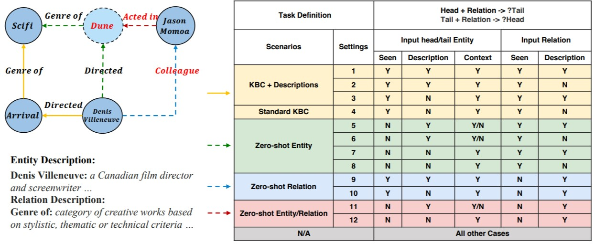

# ZeroKBC

A comprehensive benchmark that covers all scenarios of zero-shot Knowledge Base Completion (KBC) task.

## Description

We systematically examine different possible scenarios of zero-shot KBC and categorize 3 zero-shot scenarios with 8 fine-grained settings. 



* Zero-Shot Entity KBC (ZeroE)
When we see a new entity, we need to predict all the possible links between this new entity and existing entities. We may  know some context for it (some connections between this new entity and the existing KG) or we need the textual descriptions of it in the absence of connections.

* Zero-Shot Relation KBC (ZeroR):
When we see a new relation, predict if this relation exists in any pair of the entities. We will always have the textual descriptions of new relations to distinguish them.

* Zero-Shot Both KBC (ZeroB):
Predict the link for both a newly added relation and a newly added entity. Textual description is necessary for the relations as in ZeroR and entity descriptions are also required in the absence of context.


## Dataset
Please find the dataset [here](https://github.com/brickee/ZeroKBC/blob/main/ZeroKBC.zip).

## Citation

If you extend or use this dataset, please cite the [paper](https://arxiv.org/pdf/2212.03091.pdf).


```text
@article{chen2022zerokbc,
  title={ZeroKBC: A Comprehensive Benchmark for Zero-Shot Knowledge Base Completion},
  author={Chen, Pei and Yao, Wenlin and Zhang, Hongming and Pan, Xiaoman and Yu, Dian and Yu, Dong and Chen, Jianshu},
  journal={arXiv preprint arXiv:2212.03091},
  year={2022}
}
```